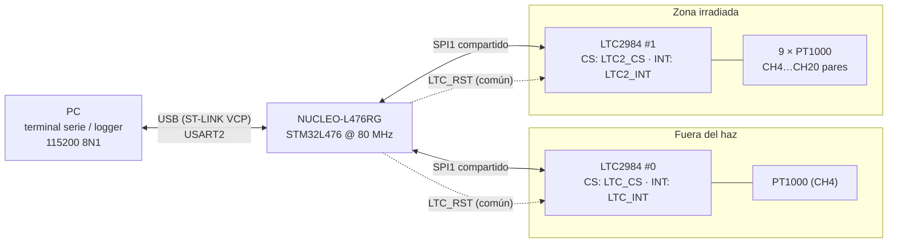
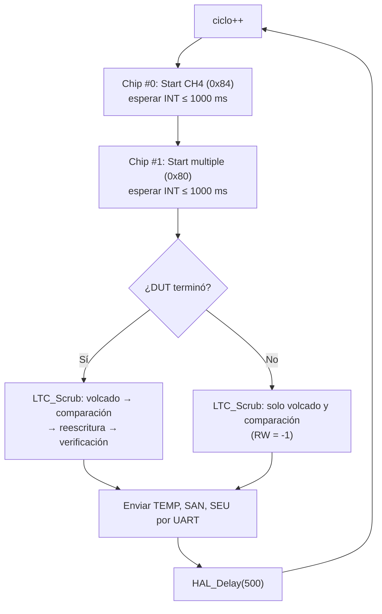

# PT1000 · Prueba de radiación del LTC2984

Firmware para **detectar y corregir SEU** (*Single Event Upsets*) en el convertidor de temperatura **LTC2984** de Analog Devices durante pruebas de radiación. Lo controla una **NUCLEO-L476RG** (STM32L476, HAL, 80 MHz).

Se usan dos LTC2984 en el mismo bus SPI:

| Chip | Papel | Qué mide |
|---|---|---|
| **#0 · `CHIP_REF`** | Referencia / control, **fuera del haz** | Conversión simple de **CH4** |
| **#1 · `CHIP_DUT`** | Dispositivo bajo prueba, **dentro del haz** | Conversión múltiple de **CH4, CH6, …, CH20** (9 × PT1000 de 2 hilos) |

En cada ciclo se compara la memoria de configuración del DUT con una copia maestra guardada en la flash del micro. Así se cuentan los bits alterados por la radiación, se corrigen y se verifica que la corrección quedó bien.

---

## Contenido del repositorio

| Archivo | Descripción |
|---|---|
| [`main.c`](main.c) | Firmware completo (proyecto STM32CubeIDE / CubeMX) |
| [`Humidity and temperature measurement.docx`](Humidity%20and%20temperature%20measurement.docx) | Documento técnico: mapa de memoria, configuración, firmware y diagrama de bloques |

---

## Hardware

| Periférico | Configuración | Comentario |
|---|---|---|
| Reloj | HSI 16 MHz → PLL (M=1, N=10, R=2) → **80 MHz** | Escalado de voltaje 1, latencia de flash 4 |
| SPI1 | Maestro, 8 bits, MSB primero, **modo 0**, NSS por software, prescaler 64 | 1,25 MHz (máx. del LTC2984: 2 MHz) |
| USART2 | **115200 8N1**, sin control de flujo | Puerto COM virtual del ST-LINK |
| `LTC_CS`, `LTC2_CS` | Salidas push-pull, inician en alto | Chip select activo en bajo |
| `LTC_INT`, `LTC2_INT` | Entradas en GPIOA, sin pull | Alto = conversión terminada (se lee por polling) |
| `LTC_RST` | Salida push-pull, inicia en alto | Reset **común** a ambos chips, activo en bajo |

---

## Configuración del LTC2984

### Mapa de memoria usado

| Dirección | Contenido | Uso |
|---|---|---|
| `0x000` | Comando/estado (bit 7 = Start, bit 6 = Done, bits 4:0 = canal) | Iniciar conversiones y comprobar vitalidad (`0x40` = listo) |
| `0x010`–`0x05F` | Resultados, 4 bytes por canal | Temperatura y bits de fallo |
| `0x0F4`–`0x0F7` | Máscara de conversión múltiple | Selecciona CH4, 6, …, 20 |
| `0x200`–`0x24F` | Asignación de canales, 4 bytes por canal | Configuración y volcado de sanidad |

### Copia maestra

Está guardada como constantes en la **flash** del micro, así que un SEU en la RAM del STM32 no la corrompe.

| Registro | Valor | Significado |
|---|---|---|
| CH2 (`0x204`) | `0xE80FA000` | Resistencia de referencia RSENSE = 1 kΩ |
| CH1, CH3…CH20 | `0x78860000` | RTD PT1000, 2 hilos, RSENSE en CH2 (compartida), 1 mA, curva europea |
| Máscara `0x0F4`–`0x0F7` | `0x000AAAA8` | `0x0F5=0x0A` (CH18, CH20) · `0x0F6=0xAA` (CH10–CH16) · `0x0F7=0xA8` (CH4, CH6, CH8) |

### Lectura de resultados

El byte alto es el **fault**. La lectura es válida si `bit0 = 1` y `(fault & 0xCE) == 0`. Los 24 bits bajos son un entero con signo; dividido entre 1024 da la temperatura en **°C**.

---

## Funcionamiento del firmware

### Inicialización

1. **Reset por hardware**: `LTC_RST` en bajo 10 ms y después espera de 1 s.
2. **Vitalidad**: `0x000` debe valer `0x40` (Start = 0, Done = 1). Resultado en `vit[chip]`.
3. **Prueba SPI**: escribe `0xDEADBEEF` en `0x204` y lo relee. Resultado en `sanity_ok[chip]`.
4. **Configuración**: `LTC_Write_Golden()` escribe los 20 canales y la máscara.
5. **Verificación inicial** del DUT con `LTC_Scrub()`. Después los contadores se ponen en cero, para que el arranque no cuente como SEU.

### Bucle principal

Si un chip no termina en 1000 ms, sus canales se reportan con temperatura **−999** y fault **`0xFF`**. Así nunca se envía la lectura del ciclo anterior como si fuera nueva.

### Scrubbing del DUT (`LTC_Scrub`)

1. **Volcado**: lee los 20 registros de canal y la máscara **antes** de corregirlos (`config_leida_ch[]`, `mask_leida`).
2. **Comparación** con la copia maestra: incrementa `seu_cnt_ch[ch]` / `seu_cnt_mask` y marca `seu_flags` (bit `ch−1` = canal, bit 20 = máscara).
3. **Reescritura** incondicional de todo.
4. **Verificación** por relectura. Si falla, incrementa `rewrite_fail_cnt` (posible daño permanente o problema de SPI).

> **Nota:** si la conversión del DUT no terminó, no se reescribe, porque no se debe escribir en la RAM del LTC2984 mientras hay una conversión en curso.

---

## Tramas UART

En cada ciclo se envían tres líneas, con los campos separados por `|`:

| Trama | Formato | Contenido |
|---|---|---|
| **TEMP** | `TEMP\|CYC:n\|C0_CH4:t:0xFF\|C1_CH4:t:0xFF\|…\|C1_CH20:t:0xFF` | Temperatura (°C) y byte de fault de cada canal |
| **SAN** | `SAN\|CYC:n\|RW:x\|FLG:0x……\|CH1:0x……\|…\|CH20:0x……\|MASK:0x……` | Registros leídos **antes** de reescribir. `RW`: 1 = verificado, 0 = falló, −1 = omitido |
| **SEU** | `SEU\|CYC:n\|CH1:n\|…\|CH20:n\|MASK:n\|RWFAIL:n` | Contadores acumulados |

**Ejemplo de detección:** un bit volteado en CH5 y otro en `0x0F6` producen `FLG:0x100010` (bit 4 = CH5, bit 20 = máscara). Se reescriben en ese mismo ciclo, así que en el volcado del ciclo siguiente ya aparecen limpios (probado con un LTC2984 simulado).

> Los contadores SEU cuentan **ciclos con el registro alterado**, no eventos. Si una corrección se omite o falla, el mismo SEU se vuelve a contar en el ciclo siguiente.

---

## Compilar y usar

1. Abrir o generar el proyecto en **STM32CubeIDE** para la NUCLEO-L476RG y reemplazar `Core/Src/main.c`.
   - Los nombres de pines (`LTC_CS`, `LTC2_CS`, `LTC_INT`, `LTC2_INT`, `LTC_RST`) deben estar definidos en CubeMX.
2. **Activar `printf` con float**: *Project → Properties → C/C++ Build → Settings → MCU Settings → "Use float with printf"* (equivale a `-u _printf_float`). Sin esto, las temperaturas salen vacías.
3. Compilar y flashear.
4. Abrir el puerto COM del ST-LINK a **115200 8N1** con cualquier terminal o logger (PuTTY, TeraTerm, script de Python…).

---

## Pendientes

- [ ] Medir en el hardware real el tiempo de la conversión múltiple de 9 canales. Si supera 1000 ms, hay que subir `CONV_TIMEOUT_MS`.
- [ ] Separar las líneas de reset. Hoy, recuperar el DUT de un latch-up también resetea la referencia.
- [ ] Agregar a la copia maestra y vigilar los registros globales `0x0F0` (unidades / filtro 50-60 Hz) y `0x0FF` (retardo del mux), tras confirmar sus valores por defecto en la hoja de datos.
- [ ] Confirmar el valor de RSENSE de CH2: el documento indica `0xE80FA933` (≈ 1002,3 Ω) y el firmware usa `0xE80FA000` (1000 Ω).
