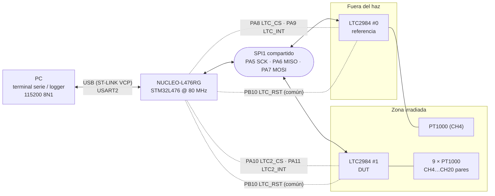
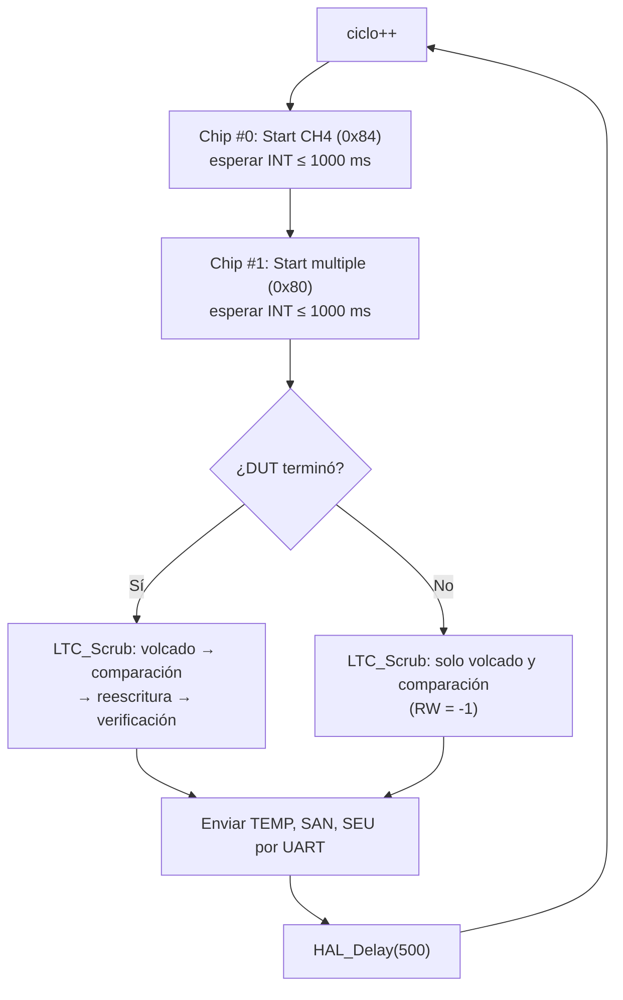

# PT1000 · Prueba de radiación del LTC2984

Firmware para **detectar y corregir SEU** (*Single Event Upsets*) en el convertidor de temperatura **LTC2984** de Analog Devices durante pruebas de radiación. Lo controla una **NUCLEO-L476RG** (STM32L476RG, HAL, 80 MHz) y los datos salen por UART al PC.

Se usan dos LTC2984 en el mismo bus SPI:

| Chip | Papel | Qué mide |
|---|---|---|
| **#0 · `CHIP_REF`** | Referencia / control. El chip está **fuera del haz**; su PT1000 está en la zona irradiada | Conversión simple de **CH4** |
| **#1 · `CHIP_DUT`** | Dispositivo bajo prueba, **dentro del haz** | Conversión múltiple de **CH4, CH6, …, CH20** (9 × PT1000 de 2 hilos) |

En cada ciclo se compara la memoria de configuración del DUT con una copia maestra guardada en la flash del micro. Así se cuentan los bits alterados por la radiación, se corrigen y se verifica que la corrección quedó bien.

---

## Contenido del repositorio

```
.
├── LTC2984_SANITY_PROTOCOL/          Proyecto STM32CubeIDE
│   ├── Core/
│   │   ├── Inc/main.h                Nombres de pines (generado por CubeMX)
│   │   └── Src/main.c                Firmware de la prueba
│   ├── Drivers/                      HAL STM32L4 y CMSIS
│   ├── LTC2984_SANITY_PROTOCOL.ioc   Configuración CubeMX
│   ├── STM32L476RGTX_FLASH.ld        Script del enlazador
│   └── LTC2984_SANITY_PROTOCOL Debug.launch
└── docs/
    ├── PINOUT.md                     Conexiones detalladas y diagrama
    ├── 2984fb.pdf                    Hoja de datos del LTC2984 (Rev. C)
    └── Humidity and temperature measurement.docx
```

---

## 1. Configuración CubeMX

Datos tomados de [`LTC2984_SANITY_PROTOCOL.ioc`](LTC2984_SANITY_PROTOCOL/LTC2984_SANITY_PROTOCOL.ioc) y del código generado.

| Elemento | Configuración |
|---|---|
| MCU | **STM32L476RGTx** (LQFP64), placa **NUCLEO-L476RG** |
| Herramientas | STM32CubeMX **6.17.0**, paquete **STM32Cube FW_L4 V1.18.2**, toolchain **STM32CubeIDE** |
| Reloj | HSI 16 MHz → PLL (M = 1, N = 10, R = 2) → **SYSCLK = HCLK = APB1 = APB2 = 80 MHz**. Latencia de flash 4, escalado de voltaje 1 |
| LSE | Pines PC14/PC15 asignados al LSE en el `.ioc`, pero `SystemClock_Config()` solo arranca el HSI |
| SPI1 | Maestro, full-duplex, 8 bits, CPOL = 0 / CPHA = 1.er flanco (**modo 0**), MSB primero, NSS por software, prescaler 64 → **1,25 Mbit/s** (máx. del LTC2984: 2 MHz) |
| USART2 | **115200 8N1**, sin control de flujo, TX/RX. Es el puerto COM virtual del ST-LINK |
| GPIO salidas | `LTC_CS` (PA8), `LTC2_CS` (PA10), `LTC_RST` (PB10): push-pull, **inician en alto** |
| GPIO entradas | `LTC_INT` (PA9), `LTC2_INT` (PA11): sin pull |
| B1 (PC13) | EXTI flanco de bajada. Configurado pero **no usado** en el código |
| Depuración | SWD (PA13 / PA14) + SWO (PB3) |
| Memoria | Stack `0x400`, heap `0x200` |
| Compilación | La configuración *Debug* ya enlaza con `-u _printf_float` (necesario para los `%f`). *Release* no lo tiene |

---

## 2. Conexiones NUCLEO-L476RG ↔ LTC2984

Resumen; la tabla completa, los pines de los sensores y el diagrama están en [`docs/PINOUT.md`](docs/PINOUT.md).

| Señal | Pin MCU | Conector NUCLEO (Arduino / Morpho) | Pin LTC2984 | Chip |
|---|---|---|---|---|
| `SPI1_SCK` | PA5 | D13 / CN10-11 | SCK (38) | #0 y #1 |
| `SPI1_MISO` | PA6 | D12 / CN10-13 | SDO (39) | #0 y #1 |
| `SPI1_MOSI` | PA7 | D11 / CN10-15 | SDI (40) | #0 y #1 |
| `LTC_CS` | PA8 | D7 / CN10-23 | CS (41) | #0 |
| `LTC_INT` | PA9 | D8 / CN10-21 | INTERRUPT (37) | #0 |
| `LTC2_CS` | PA10 | D2 / CN10-33 | CS (41) | #1 |
| `LTC2_INT` | PA11 | — / **CN10-14** (solo Morpho) | INTERRUPT (37) | #1 |
| `LTC_RST` | PB10 | D6 / CN10-25 | RESET (42) | #0 y #1 |
| `USART_TX` | PA2 | ST-LINK VCP / CN10-35 | — | — |
| `USART_RX` | PA3 | ST-LINK VCP / CN10-37 | — | — |

Conectores según el manual UM1724 (NUCLEO-L476RG); pines del LTC2984 según la hoja de datos (LQFP-48).

> **Notas**
> - **PA5 también maneja el LED LD2**: parpadeará con el reloj SPI.
> - **PA2/PA3 van al ST-LINK**, no a D1/D0 (configuración por defecto de la placa).
> - **PB3 (D3) está ocupado por SWO.** No conectar nada en D3.
> - La alimentación de las placas LTC2984 (VDD de 2,85 a 5,25 V) y su compatibilidad de niveles con los 3,3 V del STM32 no se pueden confirmar desde el proyecto. *Por verificar.*



---

## 3. Cómo funciona el firmware

Todo está en [`main.c`](LTC2984_SANITY_PROTOCOL/Core/Src/main.c).

### Protocolo SPI del LTC2984

Cada transacción es: **instrucción** (`0x02` escritura / `0x03` lectura) + **dirección de 16 bits** (MSB primero) + datos. El chip se elige bajando su CS.

| Función | Qué hace |
|---|---|
| `LTC_Write_Byte(chip, addr, data)` | Escribe 1 byte (4 bytes en el bus) |
| `LTC_Read_Byte(chip, addr)` | Lee 1 byte |
| `LTC_Write_Reg(chip, addr, data)` | Escribe 4 bytes consecutivos, MSB primero (7 bytes en el bus) |
| `LTC_Read_Reg(chip, addr)` | Lee 4 bytes consecutivos |

### Mapa de memoria usado

| Dirección | Contenido | Uso |
|---|---|---|
| `0x000` | Comando/estado (bit 7 = Start, bit 6 = Done, bits 4:0 = canal) | Iniciar conversiones y comprobar vitalidad (`0x40` = listo) |
| `0x010`–`0x05F` | Resultados, 4 bytes por canal (`0x010 + 4·(ch−1)`) | Temperatura y bits de fallo |
| `0x0F4`–`0x0F7` | Máscara de conversión múltiple | Selecciona CH4, 6, …, 20 |
| `0x200`–`0x24F` | Asignación de canales, 4 bytes por canal (`0x200 + 4·(ch−1)`) | Configuración y volcado de sanidad |

### Copia maestra (decodificada con la hoja de datos)

Está guardada como constantes en la **flash** del micro, así que un SEU en la RAM del STM32 no la corrompe.

**`0xE80FA000` → CH2 (R<sub>SENSE</sub>)**

| Bits | Campo | Valor |
|---|---|---|
| 31:27 | Tipo de sensor | `11101` = 29 → resistencia de referencia |
| 26:0 | Resistencia (17 bits enteros + 10 fraccionarios) | `0x00FA000` = 1 024 000 / 1024 = **1000,000 Ω** |

**`0x78860000` → CH1, CH3 … CH20 (PT1000)**

| Bits | Campo | Valor |
|---|---|---|
| 31:27 | Tipo de sensor | `01111` = 15 → **RTD PT-1000** |
| 26:22 | Canal de R<sub>SENSE</sub> | `00010` → **CH2** (R<sub>SENSE</sub> entre CH1 y CH2) |
| 21:18 | Hilos / modo de excitación | `0001` → **2 hilos**, masa interna, R<sub>SENSE</sub> compartida (hasta 9 RTD por chip) |
| 17:14 | Corriente de excitación | `1000` → **1 mA** |
| 13:12 | Curva | `00` → **europea** (α = 0,00385) |
| 11:0 | RTD personalizado | `0` (no se usa) |

**Máscara `0x0F4`–`0x0F7` = `00 0A AA A8`**

| Registro | Valor | Canales activos |
|---|---|---|
| `0x0F4` | `0x00` | — (reservado) |
| `0x0F5` | `0x0A` | CH18, CH20 |
| `0x0F6` | `0xAA` | CH10, CH12, CH14, CH16 |
| `0x0F7` | `0xA8` | CH4, CH6, CH8 |

### Arranque

1. **Reset por hardware**: `LTC_RST` en bajo 10 ms y después espera de 1 s (la hoja de datos indica hasta 100 ms + 100 ms).
2. Para cada chip:
   1. **Vitalidad**: lee `0x000`, que debe valer `0x40` (Start = 0, Done = 1). Resultado en `vit[chip]` (1 / −1).
   2. **Prueba SPI**: escribe `0xDEADBEEF` en `0x204` y lo relee. Resultado en `sanity_ok[chip]` (1 / −1).
   3. **Configuración**: `LTC_Write_Golden()` escribe los 20 canales y la máscara.
3. **Verificación inicial** del DUT con `LTC_Scrub()`. Después los contadores se ponen en cero, para que el arranque no cuente como SEU.

### Bucle principal



- `LTC_Wait_Done()` consulta el pin INT cada 1 ms, con un timeout de 1000 ms seguro ante el desborde de `HAL_GetTick()`.
- Los resultados se leen en `0x010 + 4·(ch−1)`. `ProcessTemperature()` separa el **byte de fallo** (bits 31–24) y convierte los **24 bits con signo** a °C dividiendo entre 1024.
- La lectura se descarta (−999) si el bit de válido (bit 24) es 0 o si `(fallo & 0xCE) != 0`.
- Si un chip no termina a tiempo, sus canales se reportan con **−999** y fallo **`0xFF`**, para no enviar la lectura del ciclo anterior como si fuera nueva.

### Scrubbing del DUT (`LTC_Scrub`)

1. **Volcado**: lee los 20 registros de canal y la máscara **antes** de corregirlos (`config_leida_ch[]`, `mask_leida`).
2. **Comparación** con la copia maestra: incrementa `seu_cnt_ch[ch]` / `seu_cnt_mask` y marca `seu_flags` (bit `ch−1` = canal, bit 20 = máscara).
3. **Reescritura** incondicional de todo.
4. **Verificación** por relectura. Si falla, incrementa `rewrite_fail_cnt` (posible daño permanente o problema de SPI).

Devuelve 1 (verificado), 0 (falló la verificación) o −1 (reescritura omitida porque la conversión no terminó).

### Tramas UART

En cada ciclo se envían tres líneas terminadas en `\r\n`, con los campos separados por `|`:

| Trama | Formato | Contenido |
|---|---|---|
| **TEMP** | `TEMP\|CYC:n\|C0_CH4:t:0xFF\|C1_CH4:t:0xFF\|…\|C1_CH20:t:0xFF` | Temperatura (°C, 2 decimales) y byte de fallo de cada canal |
| **SAN** | `SAN\|CYC:n\|RW:x\|FLG:0x……\|CH1:0x……\|…\|CH20:0x……\|MASK:0x……` | Registros leídos **antes** de reescribir. `RW`: 1 = verificado, 0 = falló, −1 = omitido |
| **SEU** | `SEU\|CYC:n\|CH1:n\|…\|CH20:n\|MASK:n\|RWFAIL:n` | Contadores acumulados |

Ejemplo ilustrativo de un ciclo con un bit volteado en CH5 y otro en `0x0F6` (líneas recortadas con `…`):

```
TEMP|CYC:42|C0_CH4:23.51:0x01|C1_CH4:23.48:0x01|C1_CH6:23.50:0x01|…|C1_CH20:23.47:0x01
SAN|CYC:42|RW:1|FLG:0x100010|CH1:0x78860000|CH2:0xE80FA000|…|CH5:0x78860400|…|CH20:0x78860000|MASK:0x000AABA8
SEU|CYC:42|CH1:0|CH2:0|CH3:0|CH4:0|CH5:1|…|CH20:0|MASK:1|RWFAIL:0
```

`FLG:0x100010` = bit 4 (CH5) + bit 20 (máscara). Ambos registros se reescriben en ese mismo ciclo, así que en el volcado del ciclo siguiente ya aparecen limpios (probado con un LTC2984 simulado).

> Los contadores SEU cuentan **ciclos con el registro alterado**, no eventos. Si una corrección se omite o falla, el mismo SEU se vuelve a contar en el ciclo siguiente.

---

## 4. Compilar, flashear y monitorear

1. Clonar el repositorio y, en **STM32CubeIDE**: *File → Import → General → Existing Projects into Workspace* → seleccionar la carpeta `LTC2984_SANITY_PROTOCOL/`.
2. Compilar en la configuración **Debug** (ya incluye `-u _printf_float`; sin eso las temperaturas salen vacías).
3. Conectar la NUCLEO por USB y flashear por **ST-LINK** (*Run* o la configuración `LTC2984_SANITY_PROTOCOL Debug`).
4. Abrir el puerto COM virtual del ST-LINK a **115200 8N1** con cualquier terminal o logger (PuTTY, TeraTerm, script de Python…).

---

## 5. Observaciones y pendientes

Detectadas al revisar el código y la hoja de datos. **Este documento no cambia la lógica del firmware.**

**Críticas (revisar antes de la prueba real)**
- [ ] **El timeout del DUT es más corto que la conversión.** Cada RTD tarda hasta 167,2 ms (hoja de datos, tabla 68); 9 canales ≈ 1505 ms, y `CONV_TIMEOUT_MS` es 1000 ms. El DUT daría timeout en todos los ciclos.
- [ ] **Volcado con la RAM bloqueada.** Si hay timeout, `LTC_Scrub` igual lee los registros, pero durante una conversión solo se puede leer `0x000`. Eso produciría falsos SEU.

**Importantes**
- [ ] `LTC_Wait_Done()` solo mira el pin INT; conviene confirmar también Start = 0 y Done = 1 en `0x000`.
- [ ] No se distingue un SEU de una pérdida de comunicación (DUT colgado → todos los registros cuentan como SEU).
- [ ] Los fallos leves (bits 27, 26, 25) se descartan como −999, aunque la hoja de datos dice que la temperatura sigue siendo utilizable.
- [ ] `vit[]`, `sanity_ok[]` y `status_reg[]` no se envían por UART; solo se ven con el depurador.
- [ ] No hay watchdog: si el micro se cuelga, el registro se detiene sin aviso.
- [ ] Los registros globales `0x0F0` (unidades / filtro 50-60 Hz) y `0x0FF` (retardo del mux) no se escriben ni se vigilan.

**Menores**
- [ ] El scrubbing y la verificación solo se hacen en el chip #1 (DUT); el chip #0 solo se configura al arrancar.
- [ ] El reset es común: recuperar el DUT de un latch-up también resetea la referencia. Conviene separar las líneas de reset.
- [ ] B1 (PC13) está configurado como EXTI, pero la interrupción no está habilitada en el NVIC y el código no lo usa.
- [ ] Los pines del LSE (PC14/PC15) están reservados en el `.ioc`, pero el oscilador no se arranca.
- [ ] Varias esperas con `HAL_Delay` bloqueante (500 ms entre pasos del arranque y 500 ms al final de cada ciclo).
- [ ] CH1 y los canales impares también se configuran como PT1000. No se convierten, pero según la hoja de datos un RTD debe estar entre CH2 y CH20.
- [ ] El archivo `LTC2984_SANITY_PROTOCOL Debug.launch` guarda una ruta de log de otro equipo (`/home/cactus-unab/…`); STM32CubeIDE la regenera al depurar.
