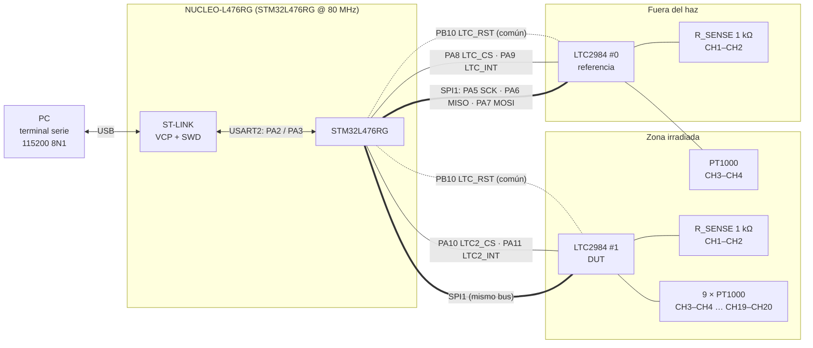

# Conexiones NUCLEO-L476RG ↔ LTC2984

Pines tomados de [`LTC2984_SANITY_PROTOCOL.ioc`](../LTC2984_SANITY_PROTOCOL/LTC2984_SANITY_PROTOCOL.ioc) y [`main.h`](../LTC2984_SANITY_PROTOCOL/Core/Inc/main.h).
Conectores de la NUCLEO según el manual UM1724 (tablas 23 y 32, NUCLEO-L476RG).
Pines del LTC2984 según la hoja de datos ([`2984fb.pdf`](2984fb.pdf), Rev. C, encapsulado LQFP-48).

## Tabla de conexiones

| Señal | Pin MCU | Arduino | Morpho | Pin LTC2984 | Chip | Dirección (MCU) |
|---|---|---|---|---|---|---|
| `SPI1_SCK` | PA5 | D13 | CN10-11 | SCK (38) | #0 y #1 | Salida |
| `SPI1_MISO` | PA6 | D12 | CN10-13 | SDO (39) | #0 y #1 | Entrada |
| `SPI1_MOSI` | PA7 | D11 | CN10-15 | SDI (40) | #0 y #1 | Salida |
| `LTC_CS` | PA8 | D7 | CN10-23 | CS (41) | #0 | Salida, inicia en alto |
| `LTC_INT` | PA9 | D8 | CN10-21 | INTERRUPT (37) | #0 | Entrada, sin pull |
| `LTC2_CS` | PA10 | D2 | CN10-33 | CS (41) | #1 | Salida, inicia en alto |
| `LTC2_INT` | PA11 | — (solo Morpho) | CN10-14 | INTERRUPT (37) | #1 | Entrada, sin pull |
| `LTC_RST` | PB10 | D6 | CN10-25 | RESET (42) | #0 y #1 | Salida, inicia en alto |
| `USART_TX` | PA2 | — (ver nota) | CN10-35 | — | ST-LINK VCP | Salida |
| `USART_RX` | PA3 | — (ver nota) | CN10-37 | — | ST-LINK VCP | Entrada |
| GND | — | GND (CN6) | p. ej. CN10-9, CN10-20 | GND (1, 3, 5, 7, 9, 12, 15, 44) | #0 y #1 | — |

Pines del MCU reservados por la configuración de CubeMX (no deben usarse para otra cosa):

| Pin | Uso | Arduino / Morpho |
|---|---|---|
| PA13 | SWDIO (`TMS`) | CN7-13 |
| PA14 | SWCLK (`TCK`) | CN7-15 |
| PB3 | SWO | D3 / CN10-31 |
| PC13 | Botón azul B1 (EXTI, flanco de bajada) | CN7-23 |
| PC14 / PC15 | LSE (OSC32_IN / OSC32_OUT) | CN7-25 / CN7-27 |
| PH0 / PH1 | RCC_OSC_IN / RCC_OSC_OUT | CN7-29 / CN7-31 |

## Notas

- **PA5 también maneja el LED verde LD2** de la NUCLEO. El LED parpadeará con el reloj SPI; es normal.
- **PA2/PA3 van al ST-LINK, no a D1/D0.** En la NUCLEO-L476RG, USART2 está conectado por defecto al puerto COM virtual del ST-LINK. Para sacarlo por D0/D1 hay que cambiar puentes de soldadura (UM1724). *Por verificar en la placa usada.*
- **PB3 (D3) está ocupado por SWO.** No conectar nada en D3.
- **PA11 no está en los conectores Arduino**, solo en el Morpho (CN10-14).
- **El bus SPI es compartido.** SDO del LTC2984 queda en alta impedancia con CS en alto, así que ambos chips pueden ir al mismo MISO. Solo un CS debe estar en bajo a la vez (el firmware lo garantiza).
- **El reset es común.** Un solo `LTC_RST` resetea los dos chips a la vez.
- **INTERRUPT** está en bajo mientras el chip arranca o convierte, y sube al terminar. El firmware lo lee por *polling* (no usa interrupciones del MCU).
- **Niveles lógicos y alimentación:** el LTC2984 admite VDD de 2,85 V a 5,25 V. La tensión de alimentación de las placas LTC2984 y su compatibilidad con los 3,3 V del STM32 no se pueden confirmar desde los archivos del proyecto. *Por verificar.*

## Sensores (lado analógico)

Convención de la hoja de datos para RTD de 2 hilos (figuras 10 y 11):

- **RSENSE (1 kΩ)** entre **CH1 (pin 16) y CH2 (pin 17)**. Su configuración va en el registro de CH2.
- Cada **PT1000** va entre **CH(n−1) y CHn**, y su configuración va en el registro de CHn.

| Chip | Canal configurado | Pines del PT1000 | Pines LTC2984 |
|---|---|---|---|
| #0 (referencia) | CH4 | CH3–CH4 | 18–19 |
| #1 (DUT) | CH4, CH6, …, CH20 | CH3–CH4, CH5–CH6, …, CH19–CH20 | 18–19, 20–21, …, 34–35 |

Regla general: el pin de CHn es **15 + n** (CH1 = pin 16 … CH20 = pin 35); COM es el pin 36.

> El esquemático de las placas LTC2984 (cableado exacto de RSENSE compartida, condensadores de filtro, alimentación) no está en el repositorio. *Por verificar.*

## Diagrama de bloques

> Que la RSENSE del chip #1 esté físicamente dentro de la zona irradiada depende del montaje. *Por verificar.*
